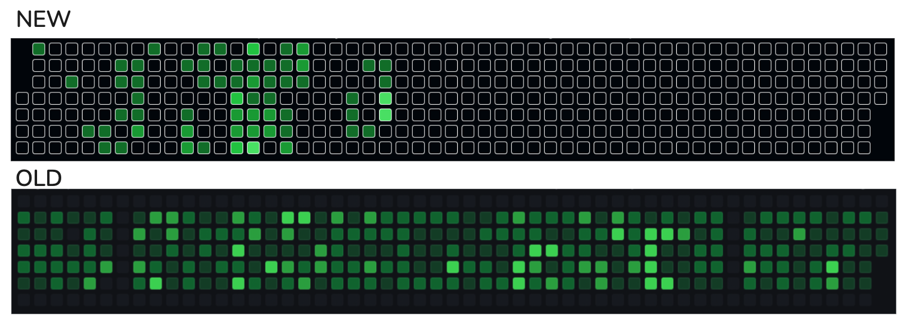

# GitHub Contribution Style Fixer
A Chrome extension that removes border-radius and border from GitHub contribution squares, giving them a clean, flat appearance.

## Features
- Removes rounded corners from GitHub contribution squares
- Removes borders from contribution squares
- Works on all GitHub profile pages
## Installation
1. Clone this repository or download the ZIP file
2. Open Chrome and navigate to chrome://extensions/
3. Enable "Developer mode" in the top-right corner
4. Click "Load unpacked" and select the extension folder
5. The extension will now be active when you visit GitHub
## Files
- manifest.json : Extension configuration
- styles.css : CSS that removes borders and border-radius
- content.js : JavaScript file for potential future functionality
## How It Works
This extension uses a simple CSS override to remove the border-radius and border properties from GitHub contribution calendar squares, giving them a clean, minimalist appearance.